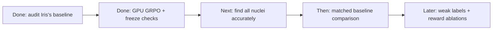

# Prompt-policy pilot: meeting brief

**We completed a 50-step GRPO pilot with frozen SAM2. The training loop works, but instance segmentation quality is still weak and PQ did not improve.**

## Progress

- Iris's original notebook is in the shared repository, with credit and source provenance. We audited her saved results without repeating her training.
- **Image → Qwen2.5-VL-7B text adapters → boxes/points → frozen SAM2.1 tiny → masks → segmentation + format rewards → GRPO.** Segmentation reward uses foreground IoU against full masks. PQ and count error are diagnostics.
- **50 steps, 49 nonzero-gradient steps, changed adapters, unchanged SAM and Qwen vision weights.** Training produced differing rewards in 42/50 groups.
- The 3B model rarely followed the output contract. With the same numeric-example prompt, the 7B diagnostic produced 7/8 valid outputs, enabling training.

## Result

Same 16 validation crops, before/after GRPO, using greedy decoding:

| Metric | Before | After |
|---|---:|---:|
| Valid outputs | 15/16 | 16/16 |
| Foreground IoU | 0.0704 | 0.0781 |
| Instance PQ | 0.0131 | 0.0131 |
| Mean absolute count error | 5.19 | 4.94 |

The pipeline returned **19 instances after training versus 98 annotated nuclei**. Finding too few nuclei is the main visible failure. The small IoU change does not establish a reliable quality gain.

## Scope and comparison

**S:** 32 full-mask training crops from 19 patients. **V:** 16 validation crops from four different patients. **W:** not used yet. **T:** official test set untouched. This is one seed on selected 128×128 crops, not a whole-image or weak-label benchmark.

Iris's same-postprocessing full/weak PQ is **0.464/0.299 (connected components)** or **0.492/0.289 (watershed)**. Her saved results use a different model and whole-image protocol, so direct comparison needs alignment.

A separate four-training-crop check gave frozen SAM IoU **0.848 with annotation-derived tight prompts**. This suggests useful masks are possible when locations are supplied; it uses privileged labels and is not learned-policy performance.

## Questions for Alex

1. Should we warm up nucleus localization with supervised box/point examples, or extend pure GRPO first?
2. Should segmentation reward use instance matching instead of foreground IoU?
3. Which shared split/evaluation protocol and success criterion should we adopt with Iris?

[Detailed evidence](reports/2026-10-09/README.md) · [Aggregate metrics](reports/2026-10-09/pilot_metrics.json)

The pilot used the existing A100 allocation, peaked at **17.83 GiB**, and took **250 seconds** including validation. Code checks: **66 tests passed**.
