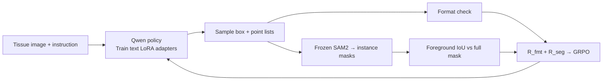

# S-Seg-RLVR

Nucleus segmentation research: learn a vision-language prompt policy while keeping the mask-generating model frozen.

## Current work

- [Iris's supervised baselines](baselines/iris/README.md): original notebook and saved outputs, copied with source provenance. They have not been rerun here.
- [Prompt-policy pilot](OVERNIGHT_PLAN.md): Qwen2.5-VL-3B text-layer LoRA adapters, frozen SAM2.1 tiny, and only segmentation plus format rewards. GPU execution must be verified from run artifacts; having this code does not establish a completed experiment.
- Small MoNuSeg crops are an engineering task. Their scores are not directly comparable with Iris's full-image scores.



## Data

Keep archives, derived crops, reference masks, checkpoints and run artifacts outside Git. Preparation reads only the training archive, separates patient groups before cropping, preserves instance IDs, and writes portable manifests with explicit exclusions. The first pilot uses 32 training and 16 validation crops, 128 pixels square, with at most eight visible nuclei.

```bash
python scripts/audit_monuseg.py \
  --train-archive /path/MoNuSeg_2018_Training_data.zip \
  --test-archive /path/MoNuSeg_2018_Testing_data.zip \
  --verify-crc --output runs/data_audit.json

python scripts/prepare_monuseg.py \
  --train-archive /path/MoNuSeg_2018_Training_data.zip \
  --out data/monuseg_engineering_v1 --border-policy visible
```

The explicit `visible` policy keeps partial nuclei, logs their IDs, and supervises all visible labeled pixels. The stricter default requires complete nuclei and may fail when too few eligible crops exist. The split is provisional until aligned with Iris's exact protocol.

## Environment and checks

Use an isolated Python 3.11 environment. CPU data/reward tests need only `requirements-cpu.txt`.

```bash
python3.11 -m venv .venv
.venv/bin/python -m pip install -r requirements-cpu.txt
.venv/bin/python -m unittest discover -s tests -v
```

For CUDA training, install Torch first, then the pinned GPU dependencies. The optional SAM2 CUDA postprocessing extension is disabled for this pilot.

```bash
.venv/bin/python -m pip install wheel==0.45.1 torch==2.5.1 torchvision==0.20.1
SAM2_BUILD_CUDA=0 .venv/bin/python -m pip install --no-build-isolation -r requirements-gpu.txt
```

Obtain the official `sam2.1_hiera_tiny.pt` checkpoint from [SAM2's checkpoint instructions](https://github.com/facebookresearch/sam2#download-checkpoints). Qwen downloads through Hugging Face; the runner records its resolved commit.

```bash
.venv/bin/python -m nucleus_rl.train --mode train \
  --manifest data/monuseg_engineering_v1/train.jsonl \
  --eval-manifest data/monuseg_engineering_v1/validation.jsonl \
  --sam-checkpoint checkpoints/sam2.1_hiera_tiny.pt \
  --output runs/pilot_10_steps --max-steps 10
```

The runner saves before/after completions, masks and overlays, reward-group variation, gradients, adapter changes, frozen-model hashes, peak GPU memory and timing. A failed or constant-reward run is not an improvement result. Foreground IoU does not detect every merge or split; instance PQ and count errors are separate diagnostics, not additional training rewards.

The official test archive is not used for training or model selection. This is research code, not a clinical system.
