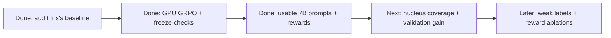

# Prompt-policy pilot: meeting brief

**We completed a 50-step GRPO pilot on an A100, using Qwen2.5-VL-7B with frozen SAM2. Training and freeze checks passed. Validation outputs became consistently valid, but instance PQ did not improve. The next challenge is finding all the nuclei accurately.**

## Pipeline and data



**Image → Qwen text LoRA → boxes and points → frozen SAM2.1 tiny → masks → `R_seg + R_fmt` → GRPO.** Only the text adapters are trainable. `R_seg` uses foreground IoU against full reference masks; `R_fmt` checks the answer format and coordinates. Invalid outputs receive zero reward. PQ and count error are additional diagnostics: foreground IoU alone can hide incorrect instance separation. This pilot uses full-mask rewards; it is not yet a weak-supervision result.

The current data preserve Iris's patient assignments while excluding six images with ambiguous/degenerate annotations. The selected **32 training / 16 validation crops** cover **19 / 4 patients**, respectively. Crops are 128×128 with at most eight visible nuclei; partial instances remain supervised. The official test set is untouched. These selected crops are not representative whole-image benchmarks.

## What the saved runs show

**Main result: Qwen2.5-VL-7B, numeric-example prompt, processed coordinates.** All **50 optimizer steps** completed; **49** had nonzero gradients. Adapters changed, while SAM and Qwen's vision encoder stayed unchanged. Of 100 training completions, **80 were valid**, **56 had positive segmentation reward**, and **42/50 groups** had differing rewards. Peak GPU reservation was **17.83 GiB**; the complete training and before/after evaluation took **250 seconds**.

| Same 16 validation crops, greedy decoding | Before GRPO | After GRPO |
|---|---:|---:|
| Valid outputs | 15/16 | 16/16 |
| Mean foreground IoU | 0.0704 | 0.0781 |
| Mean instance PQ | 0.0131 | 0.0131 |
| Mean absolute count error | 5.19 | 4.94 |

There are **98 annotated nuclei** across these crops; the pipeline returned **15 instances before and 19 after**. The small IoU change does not establish a reliable quality gain, and PQ stayed unchanged. This is one seed on four validation patients, with no final-test evaluation. It demonstrates the training loop and exposes substantial under-detection.

Earlier diagnostics explain why we switched from 3B to 7B:

| Run | Verified outcome | Interpretation |
|---|---|---|
| Original-coordinate, 10-step smoke run | 10 optimizer steps; 9 nonzero-gradient steps; adapter hash changed. Only **1/20** training completions was valid, with reward variation in **1/10** groups. | Real optimization ran, but useful rewards were very sparse. |
| Numeric-example prompt, processed coordinates | **0/8** valid completions across four training crops; no optimization. | Adding a concrete output example did not resolve formatting in this small diagnostic. |
| Processed-coordinate pilot, configured for 50 steps | Automatically **stopped at step 10**: **0/20** valid training completions, all rewards zero, zero nonzero-gradient steps, adapter hash unchanged. | It did not complete 50 steps or produce a useful update. |

Both 3B training runs have unchanged **SAM and Qwen vision-encoder parameter hashes**. Their 16-crop validation evaluations were **0/16 valid before and after**, with pipeline PQ=0 and foreground IoU=0. These zeros reflect rejected outputs.

The coordinate handling now measures Qwen's processed frame (224×224 for these 128×128 crops) and converts predicted coordinates back once for SAM. Format failures remain, including missing answer wrappers, malformed JSON, and coordinate violations. With all group rewards equal to zero, GRPO has no relative task-reward preference to learn from.

With the same numeric-example contract, the 7B training-only diagnostic produced **7/8 valid outputs** and reward variation in all four groups, allowing the bounded training run to proceed.

See [public aggregate results](pilot_metrics.json). Raw completions, masks, overlays and adapters are retained locally under `runs/` and in the Harvard workspace; they are excluded from Git.

## Reproducing the engineering configuration

[Data protocol metadata](data_protocol.json) records the preparation arguments, reconstructed patient assignments, exclusions and 48 selected crop IDs. Source archives and model weights are excluded from Git. The runner's Python source hashes and commit are recorded in `pilot_metrics.json`; the CUDA dependency versions are in [the GPU lock file](../../requirements-gpu-lock.txt).

```bash
python -m nucleus_rl.train --mode train \
  --model Qwen/Qwen2.5-VL-7B-Instruct \
  --revision cc594898137f460bfe9f0759e9844b3ce807cfb5 \
  --manifest data/monuseg_iris_pilot_v1/train.jsonl \
  --eval-manifest data/monuseg_iris_pilot_v1/validation.jsonl \
  --sam-checkpoint checkpoints/sam2.1_hiera_tiny.pt \
  --coordinate-frame processed --prompt-style example \
  --output runs/new_7b_pilot --max-steps 50
```

Use an empty output directory. Saved adapters restore their input-coordinate and prompt settings for evaluation; conflicting settings are rejected. The numeric formatting example uses invented coordinates and supplies no image-specific labels. Defaults for this run were seed 42, LoRA rank 8, learning rate 1e-5, KL coefficient 0.04, group size 2 and a 512-token completion cap. There were 2,523,136 trainable adapter parameters.

## What the oracle diagnostic establishes

On **four training crops**, annotation-derived prompts gave frozen SAM2 mean foreground IoU **0.848 with tight boxes**, **0.717 with five-pixel padding**, and **0.180 with full-image boxes**. SAM stayed unchanged. This shows prompt sensitivity with privileged label information. **It is not learned-policy performance, held-out evaluation, or a performance ceiling:** no VLM or optimizer was used. The summary and visual comparison are retained in `runs/oracle_iris_split_cpu/`.

## How this relates to Iris

Iris's saved notebook uses **37 images, split 31/6 with seed 0**, a frozen SAM ViT-B image encoder, and a trained convolutional head. It reconstructs six full validation images from overlapping 512×512 tiles and averages per-image PQ with matching **IoU >0.5**.

| Same postprocessing | Full-mask PQ | Weak-label PQ |
|---|---:|---:|
| Connected components | 0.464 | 0.299 |
| Watershed | 0.492 | 0.289 |

These are **Iris's saved results, not our reproduction**. Our crop selection, rasterizer, annotation exclusions, backbone, and training method differ. We cannot compare the pilot's numbers directly with hers. [Notebook audit](../../baselines/iris/AUDIT.md)

## Decisions for Alex

1. Should the policy get a small **training-only supervised box/point warmup** to learn nucleus localization, or should we first extend the pure-GRPO run?
2. Should `R_seg` remain foreground IoU, or include instance matching so that it reflects the task more directly? Counts and separation remain future ablations.
3. Which shared split, rasterizer and evaluation protocol should we adopt with Iris before comparing methods, and what improvement would count as the next milestone?
